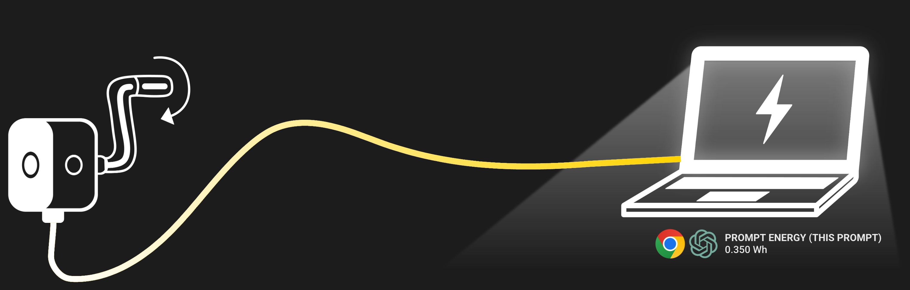

# CrankDat: Feel the Watt ⚡  
**Making AI Energy Visible**

CrankDat is an interactive project that helps people *physically experience* the energy consumed by AI models such as ChatGPT.  
While AI energy use is often expressed in abstract numbers (e.g., watt-hours, CO₂e), CrankDat translates those values into **real physical effort** through a hand-crank generator.


---

## 🚀 Overview
Most AI users don't understand how much electricity is consumed each time they send a prompt.  
CrankDat bridges this gap by connecting **digital inference energy** to **human-generated energy**.

The system combines:
1) **Energy-Estimation Chrome Extension** *(working prototype)*  
   - Estimates energy usage (Wh, mWh) per ChatGPT prompt in real-time
   - Calculates equivalent crank rotations needed (15 cranks = 1 mWh)
   - Tracks energy across entire conversations
2) **Physical Crank Device** *(prototype in progress)*  
   - Requires users to generate equivalent energy before/after a prompt  
   - Generated electricity offsets laptop power usage
   - 15 crank rotations ≈ 1 mWh of energy

This turns AI usage from an invisible process into a tangible activity.

---

## 💡 Why
People often struggle to understand and feel the real impact of something when it’s only expressed as a “number”. It’s hard to take care of something that is invisible. For example, when calculating the amount of energy usage by AI (e.g., ChatGPT), it’s difficult to understand what 1 Wh (Wattage per hour) or 1 CO₂e  (carbon dioxide equivalent) means in terms of environmental impact. So, we are trying to explore a way to properly visualize and interpret these numbers to help people better understand the hidden energy costs of AI and its effect on the climate crisis. 

---

## 🔍 Energy Reference Sources
Recent analyses found that typical ChatGPT (GPT-4o) query consumes 0.3 Wh, which is less than running a 10W lightbulb for 5 mins (EpochAI, 2025). Similarly, Google Cloud also provides their estimation of Gemini prompt’s energy usage as 0.24 Wh and 0.03 gCO₂e (Elsworth et al., 2024; Google Cloud blog, 2025).

🚧 **Ongoing Investigation**:
Better prompt-level energy accounting is needed.

---

## 🏗️ Project Status
- ✅ Chrome Extension working prototype (v0.1.1)
- ✅ Real-time energy tracking with Wh, mWh, and crank display
- ✅ Per-conversation energy totals  
- ✅ Crank hardware device completed  
---

## 🧩 Code Structure

```
crankdat/
├── assets/
│   └── imgs/
├── content.js
├── manifest.json
├── options.html
├── options.js
├── overlay.css
├── popup.html
├── popup.js
├── service-worker.js
├── PROJECT_LOG.md
└── README.md
```

## 📄 File Descriptions

| File | Purpose |
|---------------------|---------------------------------------------------------------------------------------------------|
| `manifest.json`     | Extension metadata, permissions, MV3 setup. |
| `content.js`        | Scans all ChatGPT messages, estimates tokens, computes Wh/mWh/cranks, handles streaming detection, and updates the in-page overlay in real-time. |
| `popup.html`        | Popup UI when clicking the extension icon (includes Clear History button). |
| `popup.js`          | Renders per-chat totals with Wh, mWh, and crank count; shows recent prompts color-coded by conversation. |
| `options.html`      | Settings UI for energy estimation assumptions. |
| `options.js`        | Loads/saves settings to `chrome.storage.sync` (baseline Wh/500 tokens, PUE, chars-per-token). |
| `overlay.css`       | Styles the floating overlay shown on ChatGPT (bottom-right) with energy and crank display. |
| `service-worker.js` | Background (MV3) bootstrap; initializes defaults and reserved for future events. |
| `PROJECT_LOG.md`    | Changelog tracking bugs, fixes, and feature updates. |

## 🔑 Core Logic Overview

### `content.js`

* Scans all user prompts and assistant messages on the page.
* Watches for DOM changes using MutationObserver (handles streaming responses).
* Detects streaming completion before logging to history.
* Estimates tokens (heuristic: ~4 chars/token).
* **Energy formula:**

  ```
  Wh = ((input_tokens + output_tokens) / 500)
       * baselineWhPer500Tokens
       * PUE
  ```
* **Crank conversion:**

  ```
  mWh = Wh * 1000
  cranks = mWh * 15   (15 crank rotations = 1 mWh)
  ```
* Stores entries locally with deduplication:

  ```json
  {
    "ts": <timestamp>,
    "tokens": <int>,
    "wh": <number>,
    "convoId": "<chat id>",
    "messageId": "<unique id for deduplication>"
  }
  ```
* Updates overlay with: Wh, mWh, crank count, and message count.

### `popup.js`

* Reads `history` from `chrome.storage.local`.
* Computes **This Chat Total** with Wh, mWh, and crank equivalents.
* Shows recent entries (Wh, mWh, cranks), color-coded per conversation.
* Provides "Clear All History" functionality.

### `options.js`

* Reads/saves:

  * `baselineWhPer500Tokens`
  * `pue`
  * `charsPerToken`
* Persists via `chrome.storage.sync`.

### `service-worker.js`

* On install: seeds default settings if empty.
* Placeholder for future background tasks.

### `overlay.css`

* Styling for a compact, high-contrast overlay card pinned to the bottom-right.
* Displays energy (Wh, mWh) and crank count with visual emphasis.

## 🛠️ Installation (Chrome Extension)
Follow these steps to install the CrankDat Chrome extension locally.

### **1. Clone the repository**
```bash
git clone https://github.com/rabongHan/CrankDat-AI-Energy-Visualizer.git
cd crankdat
````

### **2. Open Chrome Extensions**

Visit:

```
chrome://extensions/
```

### **3. Enable Developer Mode**

In the top-right corner, toggle **Developer mode** on.

### **4. Load the extension**

Click:

**Load unpacked** → select the project folder (the one containing `manifest.json`).

Chrome will now load CrankDat as an unpacked extension.

### **5. Open ChatGPT**

Navigate to:

* [https://chatgpt.com](https://chatgpt.com)
  or
* [https://chat.openai.com](https://chat.openai.com)

You should now see:

* A floating overlay (bottom-right) showing:
  * **Energy in Wh and mWh**
  * **Crank rotations needed** 🔄
  * **Message count**
* A popup UI (click the extension icon) showing:
  * **This chat total** with Wh, mWh, and cranks
  * **Recent prompts** with energy breakdown
  * **Clear All History** button

You can test functionalities by:
1. Ask ChatGPT any question
2. Watch the overlay update in real-time as the response streams
3. The overlay shows **Wh, mWh, and cranks** for all messages in the current chat
4. Click the extension icon to view:

   * Per-chat energy totals with crank equivalents
   * Per-prompt energy usage (Wh, mWh, cranks)
   * Color-coded chat grouping

5. Navigate to a different chat — the overlay updates automatically
6. Reload the page — values persist without duplicating

If the overlay doesn't appear, refresh the page once.


### **6. 🔄 Updating the Extension**

If you modify any files, you must reload the extension:

1. Go to `chrome://extensions/`
2. Click the **Reload** button (🔄) on the CrankDat extension card

